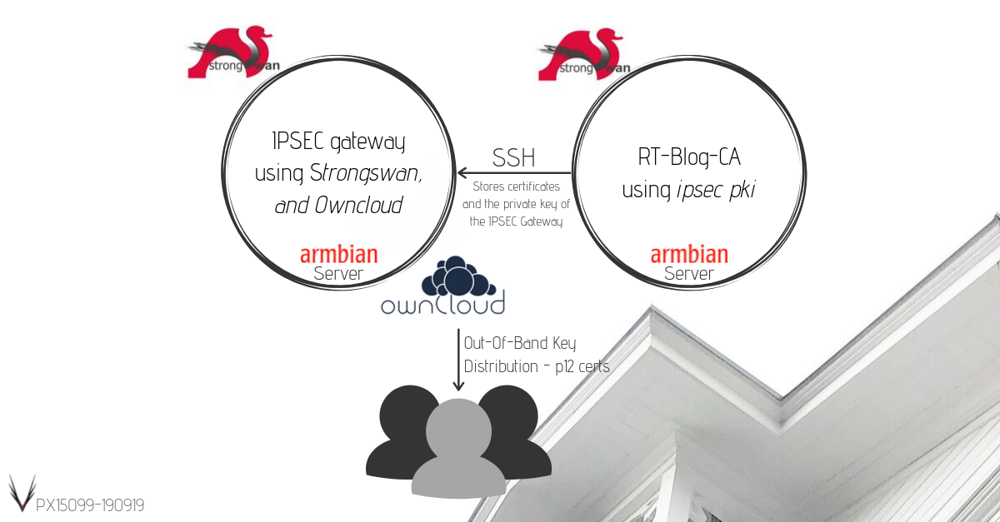

# Key Distribution Center

_Using strongswan ipsec pki, Flask web application, and SSH for certificate management_

This project provides a web-based interface and CLI tools for managing x.509 certificates created by _ipsec pki_. The system serves as a Certificate Authority (CA) management platform, with capabilities to create, transfer, revoke, and reissue certificates for IPSEC VPN infrastructure.



## Project Structure

```text
key_distribution_center/
├── central/
│   ├── images/              # Documentation images
│   ├── scripts/             # Certificate management scripts
│   │   ├── kdc.py           # Python CLI and library
│   │   ├── cert-create.sh   # Certificate creation (shell)
│   │   ├── cert-transfer.sh # Transfer certs to IPSEC gateway
│   │   ├── cert-revoke-remove.sh  # Revoke and remove certificates
│   │   ├── cert-reissue.sh        # Reissue a certificate
│   │   └── installer/       # Client installation scripts
│   └── templates/           # Configuration templates
├── webapp/                  # Flask web application
│   ├── __init__.py          # Flask app factory
│   ├── config.py            # Configuration
│   ├── api/                 # REST API endpoints
│   ├── web/                 # Web UI views
│   ├── services/            # Business logic layer
│   ├── templates/           # Jinja2 templates
│   └── static/              # CSS and static assets
├── Dockerfile               # Container image definition
├── docker-compose.yml       # Docker Compose configuration
├── requirements.txt         # Python dependencies
├── wsgi.py                  # WSGI entry point
└── README.md
```

## Quick Start with Docker

### Build and run the web application

```bash
# Build the Docker image
docker compose build

# Run with Docker Compose
docker compose up -d

# Access the web interface
open http://localhost:5000
```

### Building on ARM systems with limited kernel support

On systems like ClearFog Base (ARM mvebu) where the kernel lacks overlay, br_netfilter, and iptable_nat modules, Docker must be configured with `bridge: none`. This prevents network access during builds. Use the included build script:

```bash
# Use the build script (temporarily enables networking)
./build.sh

# Then start the container
docker compose up -d
```

The build script automatically backs up your Docker daemon configuration, enables networking for the build, then restores the original configuration.

### Development mode

```bash
# Run with hot reload enabled
docker-compose --profile dev up kdc-dev

# Access development server
open http://localhost:5001
```

## Web Interface

The Flask web application provides:

- **Dashboard**: Overview of CAs, certificates, and quick actions
- **CA Management**: Create and view Certificate Authorities
- **Certificate Management**: Create, view, delete, transfer, revoke, and reissue certificates

## REST API

### CA Endpoints

| Method | Endpoint | Description |
|--------|----------|-------------|
| GET | `/api/v1/cas` | List all CAs |
| GET | `/api/v1/cas/<domain>/<name>` | Get CA details |
| POST | `/api/v1/cas` | Create CA |

### Certificate Endpoints

| Method | Endpoint | Description |
|--------|----------|-------------|
| GET | `/api/v1/certificates` | List all certificates |
| GET | `/api/v1/certificates/stats` | Get certificate statistics |
| GET | `/api/v1/certificates/<cn>` | Get certificate details |
| POST | `/api/v1/certificates` | Create certificate |
| DELETE | `/api/v1/certificates/<cn>` | Delete certificate |
| POST | `/api/v1/certificates/<cn>/transfer` | Transfer to gateway |
| POST | `/api/v1/certificates/<cn>/revoke` | Revoke certificate |
| POST | `/api/v1/certificates/<cn>/reissue` | Reissue certificate |

### API Examples

```bash
# List all CAs
curl http://localhost:5000/api/v1/cas

# Create a CA
curl -X POST http://localhost:5000/api/v1/cas \
  -H "Content-Type: application/json" \
  -d '{"name": "myca", "domain": "example.com", "company": "Example Ltd"}'

# Create a certificate
curl -X POST http://localhost:5000/api/v1/certificates \
  -H "Content-Type: application/json" \
  -d '{
    "cn": "user@example.com",
    "ca_name": "myca",
    "ca_domain": "example.com",
    "company": "Example Ltd",
    "cert_type": "user"
  }'

# Get certificate statistics
curl http://localhost:5000/api/v1/certificates/stats
```

## Python CLI

The `kdc.py` CLI can also be used directly:

```bash
# Create a Certificate Authority
python3 central/scripts/kdc.py create-ca \
    --name myca \
    --domain example.com \
    --company "Example Ltd" \
    --country AT \
    --key-length 4096 \
    --lifetime 3650

# List CAs
python3 central/scripts/kdc.py list-cas

# Issue a certificate
python3 central/scripts/kdc.py create-cert myhost.example.com \
    --ca-name myca \
    --domain example.com \
    --company "Example Ltd" \
    --type vpn

# List certificates
python3 central/scripts/kdc.py list-certs

# Inspect a certificate
python3 central/scripts/kdc.py info STORE/certs/myhost.example.com-myca.pem

# Delete a certificate
python3 central/scripts/kdc.py delete-cert myhost.example.com-myca
```

## Shell Scripts (Advanced Usage)

The shell scripts provide additional features like interactive prompts and certificate transfer to IPSEC gateways.

### Certificate types

The `cert-create.sh` script supports three certificate types:

- **User (U)**: Personal certificates with PKCS#12 export and email notification
- **VPN Gateway (V)**: Server certificates with serverAuth and ikeIntermediate flags
- **Host (H)**: Machine certificates for IPSEC clients

### Transfer certificate to IPSEC gateway

```bash
cd central/scripts
./cert-transfer.sh STORE/certs/<certificate>.pem
```

This synchronizes certificates to the IPSEC gateway via SSH/rsync.

### Revoke and remove a certificate

```bash
./cert-revoke-remove.sh STORE/certs/<certificate>.pem
```

Updates the CRL and removes all certificate files.

### Reissue a certificate

```bash
./cert-reissue.sh STORE/certs/<certificate>.pem
```

Revokes the old certificate, creates a new one with the same configuration, and transfers it.

## Configuration

Environment variables for the web application:

| Variable | Default | Description |
|----------|---------|-------------|
| `SECRET_KEY` | dev-key | Flask secret key (change in production) |
| `FLASK_ENV` | production | Flask environment |
| `MULTI_TENANT` | true | Enable multi-tenant mode |
| `CAS_ROOT_DIR` | /app/CAs | Root directory for multi-tenant CAs |
| `STORE_DIR` | /app/central/scripts/STORE | Certificate storage (single-tenant) |
| `SCRIPTS_DIR` | /app/central/scripts | Scripts directory |
| `DEFAULT_COUNTRY` | AT | Default country code |
| `DEFAULT_CA_KEY_LENGTH` | 4096 | Default CA key size |
| `DEFAULT_CA_LIFETIME` | 3650 | Default CA validity (days) |
| `DEFAULT_CERT_KEY_LENGTH` | 3072 | Default certificate key size |
| `DEFAULT_CERT_LIFETIME` | 181 | Default certificate validity (days) |

## Multi-Tenant Mode

The web application supports managing certificates for multiple customers (domains). In multi-tenant mode, the directory structure is:

```text
CAs/
├── customer1.com/
│   ├── MainCA/
│   │   └── STORE/
│   │       ├── cacerts/
│   │       ├── certs/
│   │       ├── private/
│   │       ├── crls/
│   │       └── p12/
│   └── SubCA/
│       └── STORE/
├── customer2.org/
│   └── PrimaryCA/
│       └── STORE/
└── ...
```

Each domain (customer) can have multiple CAs, and each CA has its own STORE directory with the standard certificate storage structure.

### API with Multi-Tenant

When using the API in multi-tenant mode, specify the domain and CA name:

```bash
# List all CAs across all domains
curl http://localhost:5000/api/v1/cas

# Get certificates for a specific domain/CA
curl http://localhost:5000/api/v1/certificates?domain=example.com&ca_name=MainCA

# Create a certificate for a specific CA
curl -X POST http://localhost:5000/api/v1/certificates \
  -H "Content-Type: application/json" \
  -d '{
    "cn": "user@example.com",
    "ca_name": "MainCA",
    "ca_domain": "example.com",
    "company": "Example Ltd",
    "cert_type": "user"
  }'
```

## Certificate Storage

### Single-Tenant Mode

Certificates are stored in the following structure:

```text
STORE/
├── private/       # Private keys (.pem)
├── certs/         # Certificates (.pem)
├── cacerts/       # CA certificates (.pem)
├── crls/          # Certificate Revocation Lists (.pem)
└── p12/           # PKCS#12 bundles for users (.p12, .pass)
```

### Multi-Tenant Mode

In multi-tenant mode, each domain/CA combination has its own STORE directory. See the [Multi-Tenant Mode](#multi-tenant-mode) section for the directory structure.

## Dependencies

### Required packages (on host)

```bash
apt install strongswan strongswan-pki openssh-server rsync pwgen openssl
```

### SSH Configuration

For certificate transfer, ensure SSH key-based authentication is configured to the IPSEC gateway.

## PKCS#12 Export

User certificates are automatically exported to PKCS#12 format with OS-specific encryption:

- **Linux**: Modern OpenSSL 3.x defaults (AES/PBKDF2/SHA-256)
- **macOS/Android**: Legacy mode (3DES/RC2 + SHA-1) for compatibility

## Acknowledgments

- [strongSwan VPN HowTo](https://www.danballard.com/references/strongswan/www.zeitgeist.se/2013/11/22/strongswan-howto-create-your-own-vpn/index.html)
- [strongSwan](https://strongswan.org)
- [Flask](https://flask.palletsprojects.com/)
